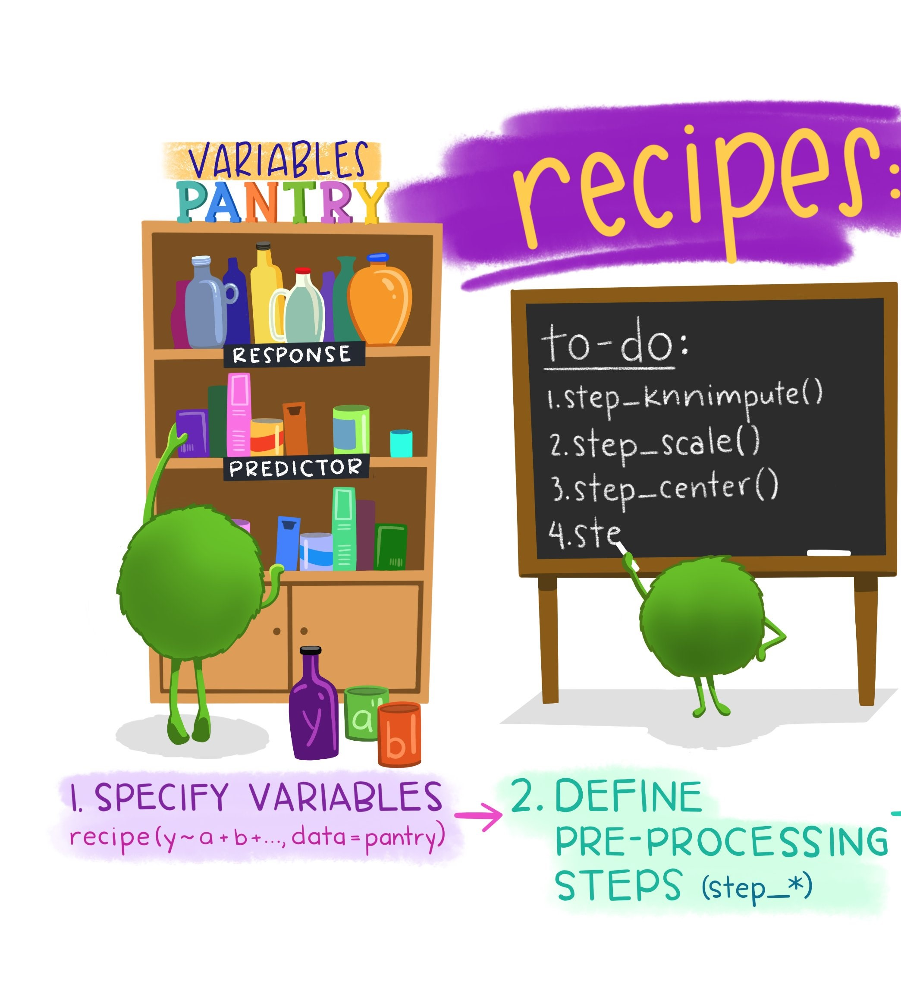
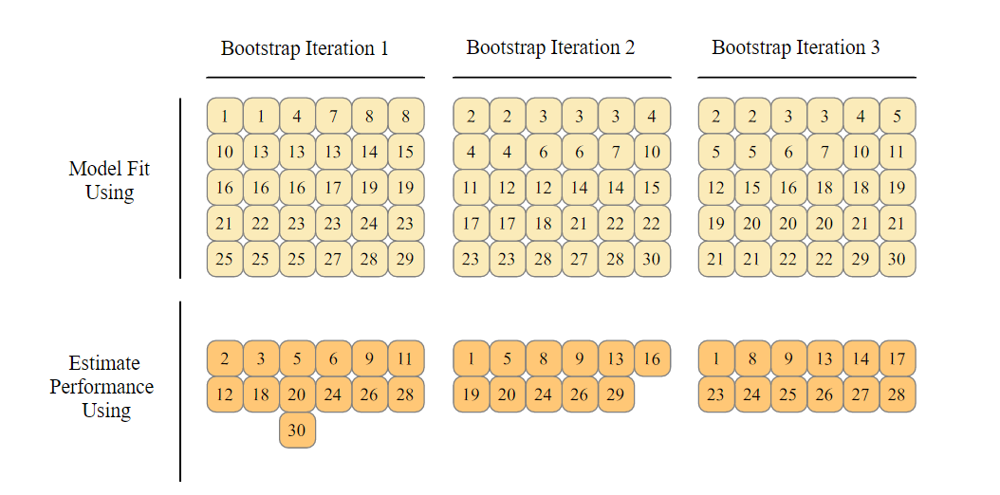

```{r setup, include=FALSE}
knitr::opts_chunk$set(warning = FALSE, message = FALSE)
suppressWarnings(if(!require("pacman")) install.packages("pacman"))

pacman::p_load('tidyverse', 'here','tidymodels', 'nnet', 'xgboost', 'palmerpenguins', 'cowplot', 'doParallel')
```

Hello and welcome to this introductory tutorial of creating machine learning using the Tidymodels framework in R. The tidymodels framework is a collection of packages for modeling and machine learning using [**tidyverse**](https://www.tidyverse.org/) principles.

Here, you will learn what you need to get started with tidymodels which sets you up to farther exciting concepts.

## {width="500"}

Meet the data

{width="500"}

Let's explore penguins!

In R, the package `palmerpenguins` by [Allison Marie Horst and Alison Presmanes Hill and Kristen B Gorman](https://allisonhorst.github.io/palmerpenguins/articles/intro.html) provides us with data related to these adorable creatures.

The `palmerpenguins` data contains size measurements for three penguin species observed on three islands in the Palmer Archipelago, Antarctica.

Let's get a glimpse of this data.

```{r}
# Load in the packages required for this adventure
library(tidyverse)
library(palmerpenguins)
library(here)

# View the first 10 rows of the data
penguins %>% 
  slice_head(n = 10)
```

```{r echo=FALSE}
library(cowplot)
ggdraw() + 
  draw_image("images/culmen_depth.png", width = 0.5) + 
  draw_image("images/peng.jpg", width = 0.5, x = 0.5)
```

Let's try predicting the species of the penguins.

## The plan

1.  Exploratory Data Analysis
2.  Preprocess data with recipes
3.  Create 2 model specifications
4.  Resampling to tune and compare model performance
5.  The last fit
6.  Model inferencing

## A little EDA

The first step in any machine learning project is typically to explore the data that you will use to train a model. The goal of this exploration is to try to understand the relationships between its attributes; in particular, any apparent correlation between the features and the label your model will try to predict.

### How many missing values do we have?

```{r}
# Sum of missing values across the columns
colSums(is.na(penguins)) %>% 
  as.data.frame()
  
```

```{r}
# Where are those missing values?
penguins %>% 
  filter(if_any(everything(), ~is.na(.x)))
```

### Explore relationship between predictors and outcome.

```{r}
# Set theme
theme_set(theme_light())

# Pivot data to a long format
penguins_select_long <- penguins %>%
  select(where(is.numeric), species, - year) %>% 
  pivot_longer(!species, names_to = "predictors", values_to = "values")

penguins_select_long %>% 
  slice_sample(n = 10)

# Make a box plot for each predictor 
theme_set(theme_light())
penguins_select_long %>%
  ggplot(mapping = aes(x = species, y = values)) +
  geom_jitter(aes(color = species),
              width = 0.1,
              alpha = 0.7,
              show.legend = FALSE) +
  geom_boxplot(aes(color = species, fill = species), width = 0.25, alpha = 0.3) +
  facet_wrap(~predictors, scales = "free") +
   scale_color_manual(values = c("darkorange","darkorchid","cyan4")) +
  scale_fill_manual(values = c("darkorange","darkorchid","cyan4")) +
  theme(legend.position = "none")

```

From the box plots, it looks like species `Adelie` and `Chinstrap` have similar data profiles for bill_depth, flipper_length, and body_mass, but Chinstraps tend to have longer bill_length. `Gentoo` tends to have fairly clearly differentiated features from the others; which should help us train a good classification model.

#### Does island of origin matter?

Starting with `penguin` data, `filter` to obtain observations where `sex` is not NA, AND THEN, `count` the sex in each island.

```{r}
penguins %>%
  count(island, species)
```

How would you visualize this?

```{r}
# Make a box plot representing the count of penguins in each island
ggplot(penguins, aes(x = island, fill = species)) +
  geom_bar(alpha = 0.8) +
  scale_fill_manual(values = c("darkorange","purple","cyan4"),
                    guide = FALSE) +
  theme_minimal() +
  facet_wrap(~species, ncol = 1) +
  coord_flip()
```

> Try doing the same for the `sex` column. What do you think about it?

With these insights in mind, we can drop some variables that won't be super helpful in our modeling.

```{r}
# Drop the year and island columns
df_penguins <- penguins %>% 
  select(-island, -year, -sex)

# View first 10 observations
df_penguins %>% 
  slice_head(n = 10)
```

## Getting started with Tidymodels

Ok! Time to fit some models.

### 1. Data budgeting

It's common practice in supervised learning to split the data into two subsets; a (typically larger) set with which to train the model, and a smaller "hold-back" set with which to validate the trained model. This enables us to evaluate how well the model performs in order to get a better estimate of how your models will perform on new data.

[rsample](https://rsample.tidymodels.org/), a package in Tidymodels, provides infrastructure for efficient data splitting and resampling:

In this section you will:

-   Create a data splitting specification i.e what proportion goes to training and what goes to testing.

-   Extract the training and testing sets.

```{r}
set.seed(123)
library(tidymodels)

# Create a data split specification with 75% of data
# used as train set and the rest as test set
penguins_split <- initial_split(df_penguins,
                                prop = 0.75,
                                strata = species)

# Extract the training and testing set
penguins_train <- training(penguins_split)
penguins_test <- testing(penguins_split)

```

### 2. Feature engineering with recipes

Feature engineering entails reformatting predictor values to make them easier for a model to use effectively.

-   creating a new predictor from the ratio of the original two
-   imputing missing values

{width="500"}

```{r}
# Create preprocessing recipe
penguins_rec <- recipe(species ~ ., data = penguins_train) %>% 
  # Impute numeric variables using mean
  step_impute_mean(all_numeric_predictors()) %>% 
  # Normalize numeric variables
  step_normalize(all_numeric_predictors())
  


# Print recipe
penguins_rec

# Summary of variables in recipe
summary(penguins_rec)
```

### 3. Create model specifications

{width="500"}

In Tidymodels, you specify models using `parsnip()`. The goal of [parsnip](https://parsnip.tidymodels.org/) is to provide a tidy, unified interface to models that can be used to try a range of models by specifying three concepts:

-   Model **type** differentiates models such as logistic regression, decision tree models, and so forth.

-   Model **engine** is the computational tool which will be used to fit the model. Often these are R packages, such as **`"lm"`** or **`"ranger"`**

-   Model **mode** includes common options like regression and classification; some model types support either of these while some only have one mode.

We'll create 2 types of models:

-   A Multinomial regression model: extension of binomial logistic regression to predict multiclass data

-   A boosted tree model: Ensemble of trees `built` **sequentially** on the `outputs` of the `previous one` in an attempt to incrementally reduce the *loss* (error) in the model.

{width="300"}

```{r}
# Create a multinomial regression model specification
mlr_spec <- 
  # Type of model
  multinom_reg(penalty = tune()) %>% 
  # Engine
  set_engine("nnet") %>% 
  # Mode
  set_mode("classification")


# Boosted tree regression model specification
boost_spec <- boost_tree() %>% 
  set_engine("xgboost") %>% 
  set_mode("classification")
```

#### Bundling it all together using a workflow

Now that we have a recipe and a model specification we defined previously, we need to find a way of bundling them together into an object that will first preprocess the data, fit the model on the preprocessed data and also allow for potential post-processing activities.

The [**workflows**](https://workflows.tidymodels.org/) package allows the user to bind modeling and preprocessing objects together. You can then fit the entire workflow to the data, such that the model encapsulates all of the preprocessing steps as well as the algorithm.

```{r}
# Logistic regression workflow
mlr_wf <- workflow() %>% 
  add_recipe(penguins_rec) %>% 
  add_model(mlr_spec)

mlr_wf

# xgboost workflow
boost_wf <- workflow() %>% 
  add_recipe(penguins_rec) %>% 
  add_model(boost_spec)

boost_wf
```

Time to train some models!!

### 4. Comparing and tuning models with Resamples

Once you create two or more models, the next step is to compare them. But should you re-predict the training set and compare model performance? How do we deal with model tuning like in this example?

The main take-away from this example is that re-predicting the training set is a **bad idea** for most models. If the test set should not be used immediately, and re-predicting the training set is a bad idea, what should be done?

*Resampling methods*, such as bootsrap resampling, cross-validation or validation sets, are the solution.

The idea of resampling is to create simulated data sets that can be used to estimate the performance of your models or tune model hyperparameters, say, because you want to compare models.

#### 

Bootstrap resampling: sampling with replacement

{width="450"}

```{r}
# Create train resample on the TRAINING SET
set.seed(123)
penguins_boot <- bootstraps(data = penguins_train)
```

Now let's compare our models. We'll start by fitting our boosted trees model to the 25 simulated analysis data sets and evaluate how it performs on the corresponding assessment sets. The final estimate of performance for the model is the average of the 25 replicates of the statistics.

```{r}
# Fit boosted trees model to the resamples
boost_rs <- fit_resamples(
  object = boost_wf,
  resamples = penguins_boot,
  metrics = metric_set(accuracy)
)


# Show the model with best metrics
show_best(boost_rs)

```

Let's do the same for our multinomial model. Remember, it has a **tuning** parameter. We can *estimate* the *best values* for these by training many models on resamples and measuring how well all these models perform. This process is called **tuning**.

Tidymodels provides a way to *tune* hyperparameters by trying multiple combinations and finding the best result for a given performance metric. That means, we need a set of possible values for each parameter to try. In this case study, we'll work through a regular grid of hyperparameter values.

```{r}
# Create a grid of tuning parameters
grid <- grid_regular(penalty(),
                          levels = 10)

# Display some of the penalty values that will be used for tuning 
grid
```

Let's try those values out.

```{r}
set.seed(2056)
doParallel::registerDoParallel()

# Tune the value for penalty
mlr_tune <- tune_grid(
  object = mlr_wf,
  resamples = penguins_boot,
  metrics = metric_set(accuracy),
  grid = grid
)

# Show model with best metrics
show_best(mlr_tune)
```

Finalize the workflow with the best value of penalty.

```{r}
# Initial workflow
mlr_wf

# Finalize the workflow
final_wf <- mlr_wf %>% 
  finalize_workflow(parameters = select_best(mlr_tune))

final_wf
```

Let's go with the multinomial model.

### 5. Make the last fit

Finally, let's return to our test data and estimate the model performance we expect to see with new data. We can use the function `last_fit()` with our finalized model; this function fits the finalized model on the full training data set and evaluates the finalized model on the testing data.

```{r}
# Make a last fit
final_fit <- final_wf %>% 
  last_fit(penguins_split)


# Collect metrics
final_fit %>% 
  collect_metrics()
```

Perhaps explore other metrics such as a confusion matrix? A confusion matrix allows you to compare the observed and predicted by tabulating how many examples in each class were correctly classified by a model.

```{r}
# Create confusion matrix
collect_predictions(final_fit) %>% 
  conf_mat(truth = species, estimate = .pred_class)

# Visualize confusion matrix
collect_predictions(final_fit) %>% 
  conf_mat(truth = species, estimate = .pred_class) %>% 
  autoplot(type = "heatmap")

# Other metrics that arise from confusion matrix
collect_predictions(final_fit) %>% 
  conf_mat(truth = species, estimate = .pred_class) %>% 
  summary() %>% 
  filter(.metric %in% c("accuracy", "sens", "ppv", "f_meas"))
```

🎓 Precision: defined as the proportion of predicted positives that are actually positive. Also called [positive predictive value](https://en.wikipedia.org/wiki/Positive_predictive_value "Positive predictive value")

🎓 Recall: defined as the proportion of positive results out of the number of samples which were actually positive. Also known as `sensitivity`.

🎓 Specificity: defined as the proportion of negative results out of the number of samples which were actually negative.

🎓 Accuracy: The percentage of labels predicted accurately for a sample.

🎓 F Measure: A weighted average of the precision and recall, with best being 1 and worst being 0.

### 6. Use the model with new data observations

Now that we have a reasonably useful trained model, we can save it for use later to predict labels for new data:

```{r}
# Extract trained workflow
penguins_mlr_model <- final_fit %>% 
  extract_workflow()

# Save workflow
saveRDS(penguins_mlr_model, "penguins_mlr_model.rds")

# Load model
loaded_mlr_model <- readRDS("penguins_mlr_model.rds") 

# Create new tibble of observations
new_obs <- tibble(
  bill_length_mm = c(49.5, 38.2),
  bill_depth_mm = c(18.4, 20.1),
  flipper_length_mm = c(195, 190),
  body_mass_g = c(3600, 3900))

# Make predictions
new_results <- new_obs %>% 
  bind_cols(loaded_mlr_model %>% 
              predict(new_data = new_obs))

# Show predictions
new_results
```

Good job! A working model 🐧🐧!

## Wrapping up and next steps.

{width="300"}

We need to *chill*, right? 😅 We hope you had a flippin' good time!

In this walkthrough you learned how classification can be used to create a machine learning model that predicts categories, or *classes*. You then used the amazing **Tidymodels** framework in `R` to train and evaluate a classification model using different algorithms, do some data preprocessing, tuned some hyperparameters and made better predictions.

Here are some resources for further reading:

-   Max Kuhn and Julia Silge, [*Tidy Modeling with R*](https://www.tmwr.org/)*.*

-   Bradley Boehmke & Brandon Greenwell, [*Hands-On Machine Learning with R*](https://bradleyboehmke.github.io/HOML/)*.*

-   H. Wickham and G. Grolemund, [*R for Data Science: Visualize, Model, Transform, Tidy, and Import Data*](https://r4ds.had.co.nz/).

-   Workshop-omatic by Microsoft Cloud Advocates, <https://github.com/microsoft/workshop-library>

-   Julia Silge weekly videos on Machine Learning with Tidymodels: <https://www.youtube.com/c/JuliaSilge/videos>

-   Upcoming Microsoft Learn R path: Create Machine Learning models with R and Tidymodels.
